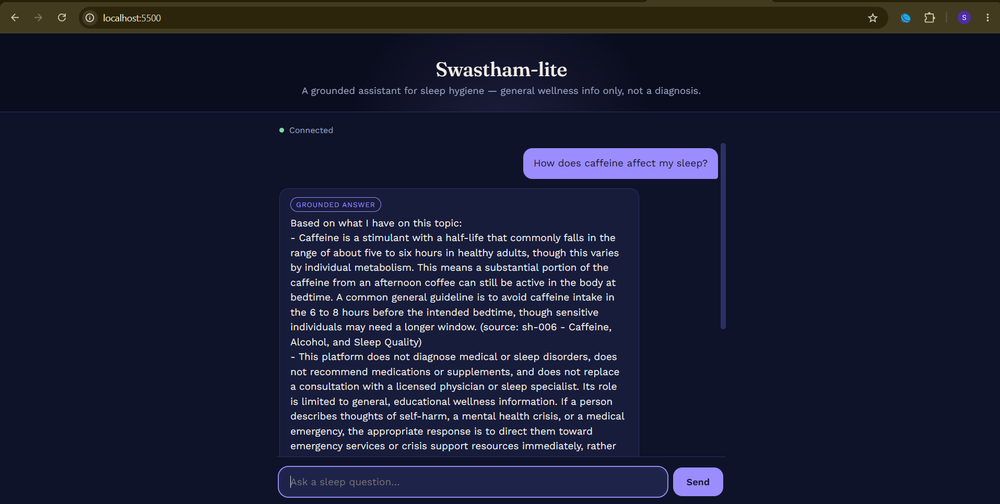
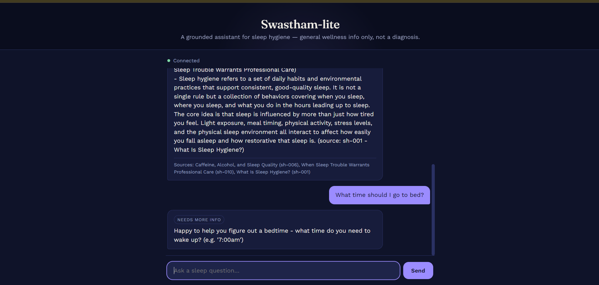
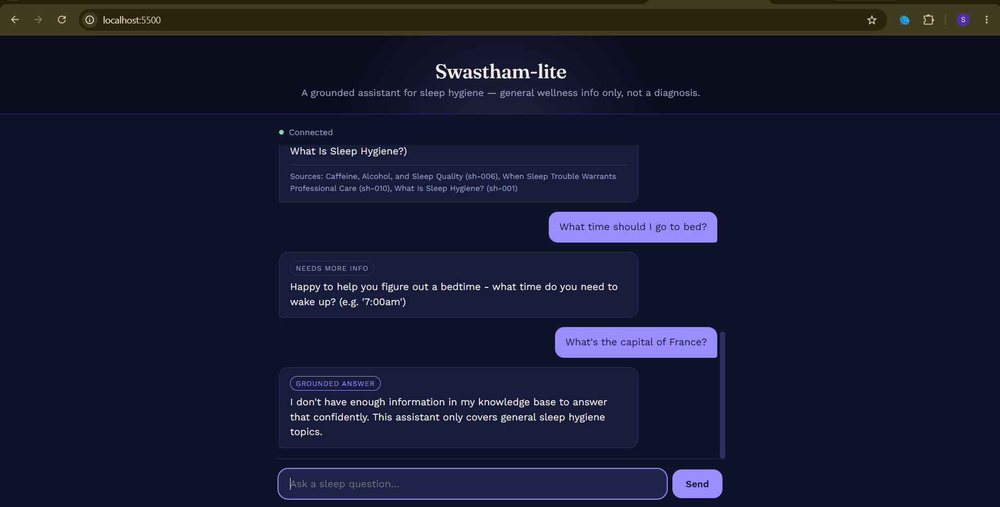

# Swastham-lite

A grounded, safety-aware AI assistant for **sleep hygiene** — RAG retrieval,
agent tools, a FastAPI backend, and a chat UI, built with an evaluation
harness to actually measure whether the system is correct and safe rather
than just demoing it.

Built as a self-directed project while preparing for an AI/ML internship
application, to practice the parts of the stack that matter most in
practice: grounding answers in real sources, handling ambiguity and safety
edge cases deliberately, and *proving* the system works with tests and a
measured eval rather than eyeballing a demo.

**Result: 92.7% pass rate** on a 41-case evaluation set covering
correctness, safety, refusal, tool routing, and cross-paraphrase
consistency — fully offline, no API key required to reproduce. Full
methodology and findings: [`eval/README.md`](eval/README.md).


### Live routing demo

Three real conversations, showing the agent choose a different path for
each message — grounded retrieval, a clarifying question, and an honest
decline when nothing relevant is in the knowledge base.

| Grounded answer, with sources | Clarify (missing info) | Refusal (off-topic) |
|---|---|---|
|  |  |  |
| "How does caffeine affect my sleep?" retrieves and cites `sh-006`. | "What time should I go to bed?" is missing the wake-up time the `bedtime_calculator` tool needs, so the agent asks instead of guessing. | "What's the capital of France?" retrieves nothing above the similarity threshold, so the assistant says so instead of forcing an answer. |

The third screenshot is also what caught a real bug: the frontend
originally labeled this refusal with a **"Grounded answer"** badge, since
a decline is technically still `mode="rag"` in the API (just with an empty
sources list) — there's no distinct "refusal" mode in the backend. Fixed
by having the frontend treat `mode="rag"` + zero sources as its own
"Couldn't help with that" badge, so a real grounded answer and a decline
are never visually indistinguishable.

## What it does

- Answers sleep-hygiene questions **grounded in a 10-document knowledge
  base**, citing sources, and declining to answer when nothing relevant
  is retrieved
- Routes to **deterministic tools** (bedtime calculator, caffeine cutoff
  calculator, wind-down routine builder) when a message calls for a
  calculation rather than general information
- Runs a **safety layer before anything else** — crisis language gets a
  fixed, calm redirect to real support resources, bypassing retrieval and
  generation entirely
- Ships as a **FastAPI backend** with session-based conversation history,
  and a **browser-based chat UI**

## Architecture

```
data/knowledge/*.md → chunking → embeddings (TF-IDF, pluggable) → vector store
                                                                        │
 message → safety check → agent router → tool  ─┐                     │
                                        └→ RAG ──┴────── retrieval ────┘
                                                    │
                                              generation + citations
```

Full component breakdown, design decisions, and known limitations are in
the "Build Log" section below, written up week by week as the project was
actually built (including real bugs found and fixed along the way).

## Quickstart

```bash
pip install -r requirements.txt
cd src && python ingest.py          # build the retrieval index

uvicorn app:app --reload --port 8000   # start the API (from src/)
```

In another terminal:
```bash
cd frontend && python -m http.server 5500
```

Open **http://localhost:5500** for the chat UI, or **http://localhost:8000/docs**
for the interactive API docs.

Run the tests and eval:
```bash
python tests/test_safety.py
python tests/test_retrieval.py
python tests/test_agent.py
cd eval && python run_eval.py
```

## Project layout

```
swastham-lite/
├── data/knowledge/   knowledge base (10 docs)
├── src/              chunking, retrieval, safety, agent, tools, FastAPI app
├── tests/            unit/regression tests
├── eval/             evaluation harness + findings writeup
└── frontend/         browser chat UI
```

---

# Build Log

The sections below are the week-by-week record of how this was actually
built, including the real bugs found during development and how they were
fixed — kept as written at the time rather than cleaned up after the fact,
since that process is as much a part of the project as the final code.

## Week 1: RAG Foundations

A grounded, safety-aware Q&A assistant for **sleep hygiene** (chosen as the narrow
domain for this project). This week builds the full retrieval pipeline: knowledge
base → chunking → embeddings → vector search → grounded generation → basic
safety layer — plus automated tests for both retrieval quality and safety behavior.

### Why sleep hygiene as the domain

Narrow enough to build a real, dense knowledge base in a week (10 docs, 20 chunks)
while still having genuine nuance (contradicting-sounding advice like "exercise
helps sleep" vs. "not too close to bedtime") that's useful for testing whether the
system stays grounded instead of overgeneralizing.

### Architecture

```
data/knowledge/*.md   →  chunking.py    →  embeddings.py   →  vector_store.py
(10 source docs,         (paragraph-      (TF-IDF, pluggable   (numpy + cosine
 YAML frontmatter          aware chunks,    for real embeddings  similarity,
 for provenance)           ~120 words,      later)               persisted index)
                           metadata-tagged)

query → safety.py (crisis/diagnosis check) → retriever.py (top-k + threshold)
      → llm.py (stub extractive / pluggable Claude API) → rag.py (orchestrator)
```

| File | Responsibility |
|---|---|
| `src/chunking.py` | Parses frontmatter metadata, splits docs into coherent ~120-word chunks |
| `src/embeddings.py` | Pluggable embedding backend (TF-IDF now, sentence-transformers later) |
| `src/vector_store.py` | Minimal vector store: build, search (cosine sim), save/load |
| `src/ingest.py` | Runs the full ingestion pipeline, saves the index to `data/index/` |
| `src/retriever.py` | Loads index, embeds queries, applies a similarity threshold |
| `src/safety.py` | Rule-based crisis and diagnosis-seeking detection, runs before retrieval |
| `src/llm.py` | Pluggable generation backend (stub / real Claude API) |
| `src/rag.py` | Orchestrates safety → retrieve → generate → package response with sources |
| `tests/test_safety.py` | Regression tests for crisis/diagnosis detection |
| `tests/test_retrieval.py` | Retrieval-quality tests (relevant doc in top-3, off-topic returns nothing) |

### Key design decisions

- **Paragraph-aware chunking, not fixed-character windows.** Keeps chunks
  topically coherent, which matters more for grounding quality than raw chunk
  count.
- **Every chunk carries provenance metadata** (`doc_id`, `title`, `topic`,
  `last_reviewed`) so every answer can cite its source and I can audit which
  chunks are actually being retrieved.
- **Pluggable embedding and LLM backends.** This sandbox has no outbound
  network access, so the default path is fully offline: TF-IDF embeddings
  (scikit-learn) + a deterministic extractive "stub LLM." Both have a
  drop-in real counterpart (`SentenceTransformerEmbedder`, `ClaudeLLM`) behind
  the same interface, controlled by an env var — swapping to a real deployment
  is a one-line change, not a rewrite.
- **Similarity threshold on retrieval**, so an off-topic query (e.g. "what's
  the capital of France?") returns *no* chunks and the pipeline says "I don't
  know" instead of forcing a grounded-sounding answer out of a weak match.
- **Safety runs before retrieval, not after generation.** Crisis-pattern
  queries never reach the knowledge base or LLM at all — they get a fixed,
  calm redirect response immediately.

### Known limitations (honest, for the eval writeup in week 3)

- **TF-IDF has no real semantic understanding** — it matches on word overlap,
  not meaning. During testing this caused a false-positive retrieval: "Recommend
  me a good stock to buy" scored just above the similarity threshold purely
  because of generic word overlap ("recommend", "good") with an unrelated chunk.
  Caught by `tests/test_retrieval.py::test_off_topic_returns_nothing`, fixed by
  retuning the threshold with a documented safety margin. The real fix is
  swapping in real embeddings (already wired up in `embeddings.py`).
- **Crisis detection is regex/keyword-based**, which is inherently brittle.
  Initial version missed "thoughts of *ending* my life" because the pattern
  only matched the exact phrase "end my life" — caught by writing a test case
  with that literal phrasing, then fixed and covered by a permanent regression
  test. A production version should add a classifier-based layer in addition
  to rules.
- **Stub LLM is extractive, not generative** — it stitches retrieved chunk
  text together rather than synthesizing a fluent answer. This is fine for
  proving retrieval + grounding + safety work correctly, but the real
  demo/eval should run with `LLM_BACKEND=claude` for actual answer quality.

### How to run

```bash
cd src
python ingest.py              # builds the index from data/knowledge/*.md
python retriever.py           # sanity-check retrieval on a few queries
python rag.py                 # full pipeline demo, including safety cases

cd ..
python tests/test_safety.py       # 3 tests
python tests/test_retrieval.py    # 2 tests
```

To switch to real backends later:
```bash
export EMBEDDING_BACKEND=sentence-transformers
export LLM_BACKEND=claude
export ANTHROPIC_API_KEY=...
```

### What's next (week 2)

- Wrap `rag.py` in a FastAPI backend with a `/chat` endpoint and session history
- Add 2–3 agent tools (e.g. a bedtime calculator, a wind-down routine builder)
- Add agent logic to decide retrieve vs. tool-call vs. clarify

---

## Week 2: Agent, Tools, and Backend API

Adds an agent layer in front of RAG that can call deterministic tools, plus
a FastAPI backend with session-based conversation history.

### What's new

| File | Responsibility |
|---|---|
| `src/tools.py` | 3 deterministic, non-diagnostic tools: bedtime calculator, caffeine cutoff calculator, wind-down routine builder |
| `src/agent.py` | Routes each message to: a tool, RAG, a clarifying question, or the crisis path — safety check always runs first |
| `src/db.py` | SQLite-backed session + message history storage |
| `src/app.py` | FastAPI backend: `POST /session`, `POST /chat`, `GET /history/{id}`, `GET /health` |
| `tests/test_agent.py` | Regression tests for tool routing (9 cases, including 3 real bugs found during dev) |
| `requirements.txt` | Pinned deps for local setup |

### Tools

All three tools are **calculators/organizers, not medical decision-makers** —
consistent with the safety posture from week 1. None diagnose anything or
recommend medication/dosages.

- **`bedtime_calculator`** — given a wake time, suggests a bedtime based on
  90-minute sleep cycles (grounded in `sh-002`)
- **`caffeine_cutoff_calculator`** — given a bedtime, suggests a last-caffeine
  time using a 6–8h half-life guideline (grounded in `sh-006`)
- **`build_winddown_routine`** — given a bedtime, builds a scheduled wind-down
  routine (grounded in `sh-009`)

### Agent routing design

Two-stage, deliberately simple and inspectable (not an LLM planner yet):

1. **Intent match** — each tool has regex patterns; the message is scored
   against all of them, and the tool with the longest total matched text
   wins. Regex (not plain keywords) so paraphrases are still caught, and
   *scored by specificity* so a message that happens to mention "bedtime"
   doesn't steal the match from a more specific tool.
2. **Slot extraction** — finds every time expression in the message
   (`"10:30pm"`, `"6am"`, `"midnight"`). If none found → ask for the missing
   time. If **more than one** found → ask which one is the relevant slot,
   rather than guessing (see bugs below for why this matters).

Crisis detection (from week 1's `safety.py`) runs before any of this, on
every message, unconditionally.

### Bugs found and fixed during dev testing

Same practice as week 1 — every bug below was caught by hand-testing or a
test I wrote in response, then locked in as a permanent regression case in
`tests/test_agent.py`.

1. **Tie-collision in routing.** "When should I stop drinking coffee if my
   bedtime is 10:30pm?" matched *both* the caffeine tool and the bedtime
   tool (1 keyword hit each), and ties silently went to whichever tool was
   registered first in the dict — wrong tool won. Fixed by scoring on total
   matched-text length instead of hit count, and removing the overly generic
   `"bedtime"` keyword (it appears in nearly every message here, since every
   tool takes a bedtime as input).
2. **Missed paraphrase.** "What's the last time I should have caffeine..."
   didn't match any literal keyword phrase. Fixed by switching from plain
   substring keywords to regex patterns, without reintroducing single-word
   generic terms like bare `"caffeine"` (which would wrongly hijack plain
   informational questions like "how does caffeine affect sleep quality?").
3. **Wrong-slot bug on multi-time messages.** "Is 10:30pm too late for my
   last coffee if bedtime is midnight?" — the extractor grabbed the *first*
   time in the message (10:30pm, the coffee time) and used it as the
   bedtime, silently producing a wrong caffeine-cutoff answer. Also exposed
   that `"midnight"` wasn't parsed at all. Fixed by extracting *all* times
   in the message and asking for clarification whenever more than one is
   found, plus adding named-time support (`midnight`/`noon`/`midday`).

### Known limitations

- **All generated app text uses plain ASCII, no em dashes.** Found via live
  testing: PowerShell's default console codepage doesn't render UTF-8 em
  dashes correctly (showed up as mojibake). Rather than rely on every
  client terminal being UTF-8 configured, all strings returned by the API
  (tool responses, RAG answers, clarify prompts) were switched to plain
  ASCII hyphens. (This README file itself still uses real em dashes for
  readability, since it's read in a markdown viewer, not a console.)
- The router is regex/keyword-based, not an LLM planner — it will miss
  phrasings not covered by the pattern list. A production version could
  route via real LLM function-calling (e.g. Claude's tool-use API) behind
  the same `Agent.handle()` interface.
- Ambiguity handling (multi-time clarification) only covers the tools built
  so far; a genuinely open-ended agent would need this pattern applied more
  generally as more tools are added.
- **`app.py` was written but could not be executed in this sandbox** — there's
  no outbound network here to `pip install fastapi/uvicorn/pydantic`. The
  exact request logic each endpoint runs (create session → agent.handle →
  store message → return) was verified directly via `db.py` + `agent.py`
  (see "How to run" below), but the FastAPI layer itself (routing,
  request/response validation, CORS) needs to be smoke-tested on your
  machine. Let me know if anything doesn't match once you run it.

### How to run

```bash
pip install -r requirements.txt

cd src
python ingest.py              # rebuilds the index if you haven't already

# Sanity-check the agent directly (no server needed)
python agent.py

# Start the API server
uvicorn app:app --reload --port 8000
```

Then, in another terminal:
```bash
# Create a session
curl -X POST http://localhost:8000/session

# Chat (replace SESSION_ID with the id returned above)
curl -X POST http://localhost:8000/chat \
  -H "Content-Type: application/json" \
  -d '{"session_id": "SESSION_ID", "message": "What time should I go to bed if I wake at 6:30am?"}'

# View history
curl http://localhost:8000/history/SESSION_ID
```

Run tests:
```bash
python tests/test_safety.py
python tests/test_retrieval.py
python tests/test_agent.py
```

### What's next (week 3)

- Build the evaluation harness: a larger Q&A test set (30–50 pairs) covering
  correctness, safety, and consistency, with automated scoring
- Regression-test prompt/retrieval changes against the eval set
- Write up the eval results as the project's headline artifact
- Simple frontend chat UI (Streamlit or minimal HTML) hitting the FastAPI backend

---

## Week 3: Evaluation Harness

Full writeup lives in **[`eval/README.md`](eval/README.md)** — dataset design,
scoring methodology, and (most importantly) the actual bugs the eval found and
how they were fixed. That file is the project's headline artifact; this
section is just a summary.

### Headline result

**92.7% (38/41)** on a 41-case, hand-written eval set spanning correctness,
completeness, refusal, crisis safety, diagnosis-seeking safety, tool routing,
and cross-paraphrase consistency — fully offline, no API key required.

The first run scored 87.8%. Debugging the 5 failures found two real bugs in
the retrieval embedder (not just eval-set quirks) — one of which was
introduced by the *fix* for the first one, caught immediately by re-running
the eval. Both are fixed and permanently regression-tested. Full story,
including exact root causes and score data, in `eval/README.md`.

### What's new

| File | Responsibility |
|---|---|
| `eval/eval_set.json` | 41 hand-written test cases across 7 categories |
| `eval/run_eval.py` | Rule-based scoring harness; prints a report and saves timestamped JSON results |
| `eval/README.md` | Full methodology + findings writeup — **read this one** |
| `src/embeddings.py` | Updated: added lightweight stemming + domain-filler stopwords (see eval findings) |
| `src/retriever.py` | Retuned similarity threshold (0.09 → 0.095) based on eval score data |

### How to run

```bash
cd eval
python run_eval.py
```

### What's next (week 4 / polish)

- Swap in `SentenceTransformerEmbedder` to close the remaining semantic-gap
  failures at the root (documented in `eval/README.md`)
- LLM-as-judge scoring once a real generation backend replaces the extractive stub

## Frontend

A single-file HTML/CSS/JS chat UI (no build step) — see
**[`frontend/README.md`](frontend/README.md)** for design notes and how to
run it. Shows each response's routing mode (tool / grounded answer / needs
more info / support resources) alongside the answer and any cited sources,
so it also works as a live demo of the agent's decision-making, not just a
chat window.